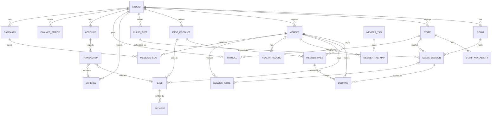

# 06. 데이터 모델 설계 (Data Model / ERD)

> 전제(확정): **2~3룸 소형 필라테스 전용** · **손익 MVP=업로드+수기 / v1=자동연동** ·
> **수업모델=균형형(규모×형식×도구)** · **클라이언트=단일 반응형 웹앱(PWA)+역할기반 뷰**.
> (운동일지/자세DB·좌석지정·대여/반납·포인트는 추후 디벨롭 — 모델에 확장 지점만 남겨둠)
> 표기: `[MVP]` 1차 출시 테이블 / `[v1]` 정식판 / `[v2+]` 이후.
> DB 가정: 관계형(PostgreSQL 권장). PK는 `id`(UUID 권장), 모든 테이블 `created_at`/`updated_at` 공통.

---

## 1. 도메인 전체 ERD



---

## 2. 모듈별 테이블 정의

### 2.1 조직 / 운영 기반

#### `studio` — 매장 `[MVP]`
| 컬럼 | 타입 | 설명 |
|------|------|------|
| id | uuid PK | |
| name | varchar | 스튜디오명 |
| biz_no | varchar null | 사업자번호 (손익/세무용) |
| tax_type | enum | 과세유형(간이/일반/면세) |
| business_hours | jsonb | 요일별 영업시간 |
| timezone | varchar | 기본 'Asia/Seoul' |
| booking_policy | jsonb | 취소마감·당일변경·노쇼차감·**차감시점(예약/출석)**·예약오픈/마감·1일한도 룰 — §6 |
| plan | enum | free / pro (수익모델) |

#### `room` — 룸 `[MVP]`
| 컬럼 | 타입 | 설명 |
|------|------|------|
| id | uuid PK | |
| studio_id | uuid FK | |
| name | varchar | 예: A룸, 기구실 |
| capacity_default | int | 기본 정원(세션에서 override 가능) |

#### `staff` — 직원(오너/매니저/강사) `[MVP]`
| 컬럼 | 타입 | 설명 |
|------|------|------|
| id | uuid PK | |
| studio_id | uuid FK | |
| name | varchar | |
| phone | varchar | |
| role | enum | `owner` / `manager` / `instructor` |
| status | enum | active / inactive |
| pay_rule | jsonb null | 정산룰(시급/세션제/매출배분) — `[v1]` payroll에서 사용 |

> 권한은 `role` 기준 RBAC. (owner=전체, manager=운영/매출, instructor=본인 스케줄·담당회원)

#### `staff_availability` — 강사 근무가능 시간 `[MVP]`
| 컬럼 | 타입 | 설명 |
|------|------|------|
| id | uuid PK | |
| staff_id | uuid FK | |
| weekday | int | 0~6 |
| start_time / end_time | time | |
| valid_from / valid_to | date null | 기간 한정(휴가 등은 별도 처리) |

---

### 2.2 회원

#### `member` — 회원 `[MVP]` (★3축 상태 분리 — [07 §1](07-member-management.md))
| 컬럼 | 타입 | 설명 |
|------|------|------|
| id | uuid PK | |
| studio_id | uuid FK | |
| auth_user_id | uuid FK null | 로그인 계정 링크(셀프서비스). 운영자 등록 직후엔 null |
| name | varchar | |
| phone | varchar | **매칭 키** (앱 셀프가입 ↔ 운영자 등록 병합) |
| gender | enum null | |
| birth | date null | |
| photo_url | varchar null | |
| account_status | enum | `invited` / `active` / `withdrawn` (로그인 계정) |
| approval_status | enum | `pending` / `approved` / `rejected` (스튜디오 등록 승인) |
| lifecycle_status | enum | `active` / `dormant` / `expiring` / `churn_risk` (자동 태깅 `[v1]`) |
| memo | text null | 운영자 메모 |
| invited_at | timestamptz null | 초대 발송 시각 |
| joined_at | date | 최초 등록일 |
> 매칭: 운영자 등록(invited+approved) ↔ 회원 셀프가입(pending) 을 phone으로 연결·병합.
> **스튜디오 게이트**: `studio_id` NOT NULL — 회원은 항상 스튜디오 귀속. 미승인(`pending`)은 예약·마이페이지 이용 제한.
> **MVP 범위(재조정)**: 운영자 **초대 단방향**(invited→active)만. 회원 셀프가입(pending)+승인큐+번호병합은 `[v1]`.
> 마케팅/약관 동의는 아래 `member_consent`로 분리(이력 보존).

#### `member_tag` / `member_tag_map` — 태그 `[v1]`
- `member_tag`: id, studio_id, name(VIP/산전/재활…), color
- `member_tag_map`: member_id, tag_id (N:M)

#### `health_record` — 건강·체형 기록 `[v1]` ★강습형 특화
| 컬럼 | 타입 | 설명 |
|------|------|------|
| id | uuid PK | |
| member_id | uuid FK | |
| recorded_at | date | |
| goal | text null | 목표(체형교정/통증완화…) |
| pain_areas | jsonb null | 통증 부위 |
| body_metrics | jsonb null | 체중/둘레 등 |
| photos | jsonb null | 전후 사진 url |
> 민감정보 → 암호화 저장, 접근 로그.

#### `session_note` — 수업일지 `[v1]`
| 컬럼 | 타입 | 설명 |
|------|------|------|
| id | uuid PK | |
| member_id | uuid FK | |
| class_session_id | uuid FK null | 어떤 수업에서 |
| staff_id | uuid FK | 작성 강사 |
| content | text | 진행내용/다음목표 |

#### `member_consent` — 동의 이력 `[MVP 가입 필수동의 / v1 이력·마케팅토글]`
| 컬럼 | 타입 | 설명 |
|------|------|------|
| id | uuid PK | |
| member_id | uuid FK | |
| type | enum | `terms`(이용약관) / `privacy`(개인정보) / `marketing`(수신) |
| agreed | bool | 동의/철회 |
| agreed_at | timestamptz | 동의·철회 시각(이력 누적) |
> 가입(앱) 시 **이용약관·개인정보 수집 동의는 MVP 필수**(법적). 동의 이력 관리·마케팅 토글은 `[v1]`.

#### `consultation` — 상담·리드 `[v1]`
| 컬럼 | 타입 | 설명 |
|------|------|------|
| id | uuid PK | |
| studio_id | uuid FK | |
| name / phone | varchar | 잠재고객(미등록) |
| status | enum | `lead` / `booked` / `converted` / `dropped` |
| scheduled_at | timestamptz null | 상담 예약 시각 |
| memo | text null | 상담 메모 |
| converted_member_id | uuid FK null | 회원 전환 시 연결(전환율 집계) |

---

### 2.3 수강권 / 결제

#### `pass_product` — 수강권 상품 정의 `[MVP]`
| 컬럼 | 타입 | 설명 |
|------|------|------|
| id | uuid PK | |
| studio_id | uuid FK | |
| name | varchar | 예: 개인 10회권 |
| kind | enum | `count`(회차) / `period`(기간) / `hybrid` |
| class_scope | enum | `personal` / `duet` / `group` / `any` (class_type.size와 매칭) |
| total_count | int null | 회차권 총 횟수 |
| valid_days | int null | 유효기간(일) |
| price | int | 정가 |
| active | bool | 판매중 여부 |

#### `member_pass` — 회원 보유 수강권(발급 인스턴스) `[MVP]`
| 컬럼 | 타입 | 설명 |
|------|------|------|
| id | uuid PK | |
| member_id | uuid FK | |
| pass_product_id | uuid FK | |
| sale_id | uuid FK | 어느 판매로 발급됐는지 |
| start_at / expire_at | date | |
| remaining_count | int null | 잔여 횟수(차감 대상) |
| status | enum | `active` / `paused` / `expired` / `refunded` |
| paused_ranges | jsonb null | 홀딩 기간들(만료 자동 연장) `[MVP]` |
> **홀딩(정지/재개+만료연장)·단순 환불은 MVP**(운영 첫날부터 발생). 부분환불 계산·양도는 `[v1]`.
> 차감 시점·여러 수강권 보유 시 선택 우선순위는 **§6 핵심 비즈니스 규칙** 참조.

#### `sale` — 판매(약정 매출의 단위) `[MVP]`
| 컬럼 | 타입 | 설명 |
|------|------|------|
| id | uuid PK | |
| studio_id | uuid FK | |
| member_id | uuid FK | |
| pass_product_id | uuid FK null | 수강권 판매면 |
| item_name | varchar | 상품명 스냅샷 |
| amount | int | 판매 금액(할인 후) |
| discount | int | 할인액 |
| sold_at | date | 판매일 |
| sold_by | uuid FK(staff) null | 판매 강사(실적/정산용) |
| status | enum | `confirmed` / `refunded` / `partial_refund` |
> "약정 매출"의 원천. 실제 입금은 `payment` + `transaction` 대사로 검증.

#### `payment` — 결제 기록 `[MVP]`
| 컬럼 | 타입 | 설명 |
|------|------|------|
| id | uuid PK | |
| sale_id | uuid FK | |
| method | enum | `card` / `cash` / `transfer` / `easy_pay` |
| amount | int | |
| paid_at | date | |
| is_received | bool | 실입금 확인 여부(미수금 추적) |
| cash_receipt | enum null | 현금영수증 `none` / `issued` (발행 여부) `[MVP]` |
| cash_receipt_no | varchar null | 현금영수증 승인번호 `[v1]` |
> **미수금 표시 = MVP** (sale.amount − Σ received). 현금영수증 발행 체크는 매출 증빙·부가세용(누락 보완). PG 연동은 `[v2+]`.

---

### 2.4 수업 / 예약

#### `class_type` — 수업 유형 `[MVP]` (★균형형 모델: 규모 × 형식 × 도구)
| 컬럼 | 타입 | 설명 |
|------|------|------|
| id | uuid PK | |
| studio_id | uuid FK | |
| name | varchar | 예: 그룹 매트, 개인 기구, 듀엣 리포머 |
| size | enum | `personal`(1:1) / `duet`(2:1) / `group`(소그룹) |
| format | enum | `regular`(정규=관리자 배정) / `open`(자유수강=회원 셀프) |
| equipment | jsonb | 도구 태그 배열 `["기구","매트","소도구"]` (필터·통계용) |
| duration_min | int | 소요시간 |
| default_capacity | int | 정원 (personal=1, duet=2, group=N) |
| min_capacity | int null | `open`일 때 최소 진행 인원(미달 시 자동폐강) |
| seat_assignment | bool | 좌석/기구 지정 예약 사용 여부 (기본 false, **후순위 `[v1+]`**) |
> **MVP는 size(개인/듀엣/그룹) + 회원 셀프예약 + 대기**까지.
> ④자유수강형 자동폐강(`format=open`·min_capacity·auto_close)·⑤좌석지정·⑥고정반은 `[v1]` (모델 필드만 남기고 동작 후순위).

#### `class_session` — 수업 세션(실제 스케줄 1건) `[MVP]`
| 컬럼 | 타입 | 설명 |
|------|------|------|
| id | uuid PK | |
| studio_id | uuid FK | |
| class_type_id | uuid FK | |
| room_id | uuid FK | |
| staff_id | uuid FK | 담당 강사 |
| start_at / end_at | timestamptz | |
| capacity | int | 정원(override) |
| min_capacity | int null | `open` 세션 최소 진행 인원(class_type값 override) |
| auto_close_at | timestamptz null | 자유수강형 미달 판정 시점(예: 시작 N시간 전) `[v1]` |
| status | enum | `scheduled` / `closed`(폐강) / `canceled` / `done` |
| recurrence_id | uuid null | 반복생성 묶음 `[v1]` |
> 인덱스: (studio_id, start_at), (staff_id, start_at), (room_id, start_at) 시간겹침 검증.
> 자유수강형(`open`): `auto_close_at`에 예약수 < min_capacity면 status=closed 자동폐강 +
> 해당 booking 전부 수강권 복구(consumed→false) + 회원 알림. → 상태머신 §3.

#### `booking` — 예약 + 출석 `[MVP]`
| 컬럼 | 타입 | 설명 |
|------|------|------|
| id | uuid PK | |
| class_session_id | uuid FK | |
| member_id | uuid FK | |
| member_pass_id | uuid FK | 차감 대상 수강권 |
| status | enum | `booked` / `waitlist` / `canceled` / `attended` / `no_show` |
| booked_at | timestamptz | |
| canceled_at | timestamptz null | |
| consumed | bool | 수강권 차감 여부(attended/no_show 정책에 따라) |
| seat_label | varchar null | 좌석/기구 지정(예: "리포머 3"). class_type.seat_assignment=true일 때만 `[v1+]` |
> 제약: UNIQUE(class_session_id, member_id) 활성예약 중복방지.
> seat_assignment 시 추가 제약: UNIQUE(class_session_id, seat_label).
> 대기→예약 자동승급은 `[v1]` (취소 시 트리거).

---

### 2.5 매출·비용·손익 (Finance) ★

> MVP 핵심: `expense`(수기) + `sale`(판매매출) + `transaction`(업로드 자동분류) + `finance_period`(월손익).
> v1: `account`(자동연동) + `payroll`(강사정산) + 자동 대사.

#### `expense` — 비용 `[MVP]`
| 컬럼 | 타입 | 설명 |
|------|------|------|
| id | uuid PK | |
| studio_id | uuid FK | |
| category | enum | `rent`/`payroll`/`tax`/`lease`/`supplies`/`marketing`/`utility`/`fee`/`etc` |
| amount | int | |
| spent_at | date | |
| memo | varchar null | |
| is_recurring | bool | 반복(임대료 등) 자동생성 대상 `[v1]` |
| transaction_id | uuid FK null | 자동연동 거래에서 생성된 경우 |

#### `account` — 연동 계좌/카드 `[v1]`
| 컬럼 | 타입 | 설명 |
|------|------|------|
| id | uuid PK | |
| studio_id | uuid FK | |
| type | enum | `bank` / `card` |
| provider | varchar | 은행/카드사 |
| alias | varchar | 표시명 |
| connection | enum | `sms`(MVP) / `upload`(MVP) / `openbanking` / `mydata` |
| last_synced_at | timestamptz null | |

#### `transaction` — 거래 원장(통합) `[MVP: 업로드, v1: 자동]`
| 컬럼 | 타입 | 설명 |
|------|------|------|
| id | uuid PK | |
| studio_id | uuid FK | |
| account_id | uuid FK null | 업로드면 null 가능 |
| occurred_at | date | 거래일 |
| amount | int | 부호 또는 direction으로 |
| direction | enum | `income` / `expense` / `transfer_or_excluded` |
| raw_desc | varchar | 적요 원문 |
| category | enum null | 분류 결과 |
| rule_id | uuid FK null | 적용된 분류규칙 |
| source | enum | `sms_capture`(MVP) / `upload_csv`(MVP) / `openbanking` / `mydata` / `manual` |
| matched_sale_id | uuid FK null | 입금↔판매 대사 |
| matched_expense_id | uuid FK null | 지출↔비용 |
| status | enum | `auto` / `needs_review` / `confirmed` |
> 중복방지 키: (account_id, occurred_at, amount, raw_desc) 해시 — 재업로드 dedupe.

#### `classification_rule` — 자동분류 규칙 `[v1]` (MVP는 수동 분류 + 반복거래 템플릿)
| 컬럼 | 타입 | 설명 |
|------|------|------|
| id | uuid PK | |
| studio_id | uuid FK | |
| match_field | enum | `raw_desc` / `amount` / `counterparty` |
| match_op | enum | `contains` / `equals` / `regex` |
| match_value | varchar | |
| set_direction | enum | income/expense/excluded |
| set_category | enum | |
| priority | int | 충돌 시 우선순위 |
> "한번 분류하면 같은 거래처 자동" = 사용자가 분류할 때 규칙 자동 제안·생성.

#### `payroll` — 강사 급여 정산 `[v1]`
| 컬럼 | 타입 | 설명 |
|------|------|------|
| id | uuid PK | |
| studio_id | uuid FK | |
| staff_id | uuid FK | |
| period | varchar | 'YYYY-MM' |
| computed_amount | int | 정산룰×실적 산출 |
| detail | jsonb | 세션수/매출배분 내역 |
| expense_id | uuid FK null | 확정 시 expense로 편입 |
| status | enum | draft / confirmed / paid |

#### `finance_period` — 월 손익 마감 스냅샷 `[v1]` (MVP는 온더플라이 집계)
| 컬럼 | 타입 | 설명 |
|------|------|------|
| id | uuid PK | |
| studio_id | uuid FK | |
| period | varchar | 'YYYY-MM' |
| income_total | int | 수입 합 |
| expense_total | int | 비용 합 |
| net_profit | int | 순이익 |
| breakdown | jsonb | 카테고리별 집계 캐시 |
| closed | bool | 마감 여부 |

---

### 2.6 알림 / CRM

#### `campaign` — 캠페인(세그먼트 발송) `[v1]`
| 컬럼 | 타입 | 설명 |
|------|------|------|
| id | uuid PK | |
| studio_id | uuid FK | |
| type | enum | `expiry`(만료임박)/`winback`(이탈방지)/`notice`/`event` |
| segment_rule | jsonb | 대상 조건(만료 D-7, 출석 급감 등) |
| template | text | 메시지 템플릿 |
| channel | enum | `push` / `alimtalk` / `sms` |
| scheduled_at | timestamptz null | |

#### `message_log` — 발송 이력 `[MVP: 기본알림]`
| 컬럼 | 타입 | 설명 |
|------|------|------|
| id | uuid PK | |
| studio_id | uuid FK | |
| member_id | uuid FK | |
| campaign_id | uuid FK null | 캠페인 발송이면 |
| kind | enum | booking_confirm/cancel/expiry/no_show/custom |
| channel | enum | push/alimtalk/sms |
| status | enum | queued/sent/failed/read |
| sent_at | timestamptz null | |

---

## 3. 핵심 상태 머신

### 예약(booking.status)
```
booked ──cancel──▶ canceled
  │                   │(정원 빈자리)
  │                   ▼
  │              waitlist ──promote(v1)──▶ booked
  ├──출석확정──▶ attended (수강권 -1)
  └──노쇼──────▶ no_show  (정책 시 -1)
```

### 자유수강형(open) 세션 자동폐강 `[v1]`
```
open 세션 ──auto_close_at 도달──▶ 예약수 ≥ min_capacity ?
   ├─ 예 ───▶ 진행 (scheduled 유지)
   └─ 아니오 ─▶ session=closed + 모든 booking 수강권 복구(consumed→false) + 회원 알림
```
> personal/duet/group-regular는 관리자 배정·항상 진행이라 자동폐강 대상 아님.

### 거래(transaction.status)
```
import ─▶ auto(규칙매칭) ─▶ confirmed
          │(애매)
          ▼
        needs_review ──사용자 분류──▶ confirmed (+규칙 학습)
```

### 수강권(member_pass.status)
```
active ──소진/만료──▶ expired
   │
   ├──홀딩(v1)──▶ paused ──복귀──▶ active(만료일 연장)
   └──환불──────▶ refunded
```

---

## 4. MVP 테이블 우선순위 (개발 착수 순서)

**1순위 (코어 운영):** studio, room, staff, staff_availability, member, member_consent(가입동의), pass_product, member_pass(홀딩 포함), class_type, class_session, booking
**2순위 (판매/손익 씨앗):** sale, payment(미수금·현금영수증), expense, transaction(**SMS캡처** + CSV업로드 + 수기)
**3순위 (알림):** message_log (+ 기본 트리거)

**v1 확장:** classification_rule(자동분류), finance_period(마감캐시), account(자동연동·SMS계좌메타), payroll, campaign, member_tag(_map), consultation, 셀프가입·승인큐, health_record, session_note, member 자동 태깅

> 재조정(리뷰 반영): 규칙엔진·마감캐시·셀프가입큐는 **v1로 강등**, 홀딩/미수금/가입동의/현금영수증·**SMS캡처**는 **MVP로 승격**.

---

## 5. 설계 원칙 메모

- **멀티테넌시**: 거의 모든 테이블에 `studio_id` → 행 단위 격리(향후 다지점 `[v2+]`도 동일 패턴).
- **약정매출(sale) ↔ 실입금(transaction) 분리**: 차별화의 핵심. 둘을 대사(match)로 잇는다.
- **손익 = transaction 기반이 진실**, sale은 영업지표. finance_period가 월별 캐시.
- **소프트 삭제 권장**: 회원/매출은 `deleted_at` 으로 보존(정산·세무 추적).
- **개인정보/민감정보(health_record)**: 암호화 + 접근로그 + 동의(marketing_consent/약관).
- **금액 단위**: 원(KRW) 정수. 통화 컬럼 불필요(국내 전용).
- **시간**: timestamptz 저장, 표시는 studio.timezone.

---

## 6. 핵심 비즈니스 규칙 (구현 전 확정 — 리뷰 보강)

> 예약·수강권·손익의 "심장" 규칙. 명세가 비면 정합성이 깨지므로 와이어프레임/구현 전에 확정.

### 6.1 예약 자격 검증 (booking eligibility) `[MVP]`
회원 예약 시 아래를 **모두** 통과해야 확정:
1. 유효 `member_pass` 보유(`status=active`, 만료 전)
2. 잔여 횟수 > 0(회차권) 또는 기간 내(기간권)
3. `pass_product.class_scope` ∈ {수업 `class_type.size`, `any`} — 개인권으로 그룹 예약 불가
4. 동시간대 중복 예약 없음
5. `booking_policy`: 예약 오픈(D-N) ~ 마감(시작 N시간 전) 이내, 1일 예약 한도 미초과
6. 정원 여석 > 0 (없으면 대기예약)
> 실패 시 **사유 코드** 반환: 잔여없음 / 만료 / scope불일치 / 마감 / 한도초과 / 만석.

### 6.2 수강권 차감 시점 정책 `[MVP]` (`studio.booking_policy`)
| 정책 | 동작 | 용도 |
|------|------|------|
| `on_attend`(기본) | 출석 확정 시 −1 | 일반 |
| `on_book` | 예약 시 −1, 취소 시 복구 | 노쇼 방지형 |
> 취소·노쇼·폐강 시 복구 규칙도 정책에 연동(예: 마감 후 취소는 차감 유지).

### 6.3 수강권 선택 우선순위 `[MVP]`
여러 `member_pass` 보유 시 차감 대상 자동 선택:
1. 수업 `class_scope` 매칭되는 것 중 → 2. **만료 임박 우선**(expire_at) → 3. 잔여 적은 순 → 4. 발급 오래된 순
> 운영자/회원이 수동 변경(override) 가능.

### 6.4 손익 회계 기준 — **현금주의 단일** `[MVP]` ★★
- "이번달 순이익"은 **실제 현금흐름(현금주의)** 으로 통일: **수입=실입금, 비용=실지출**.
- `sale`(약정매출)은 **영업지표(미수금·예상매출)로만** 표시, **손익 합산엔 미포함** → **이중계상 방지**.
- 카드매출은 **카드사 정산 입금일** 기준 수입 인식(합산정산은 추정 대사 + 수기 보정).
- 사적·내부·계좌간 이체는 `transfer_or_excluded`로 손익 제외.
> ⚠️ 이 기준이 흔들리면 순이익 숫자 신뢰가 깨져 **차별화가 자폭** → 최우선 불변 원칙.

### 6.5 동시성 (정원 경쟁) `[MVP]`
- 마지막 1석 동시 예약·대기 자동승급은 **원자적 정원 카운터 / 행 잠금**으로 초과예약 방지.
- `UNIQUE(class_session_id, member_id)`는 중복예약만 차단 — 정원 초과는 별도 처리.
