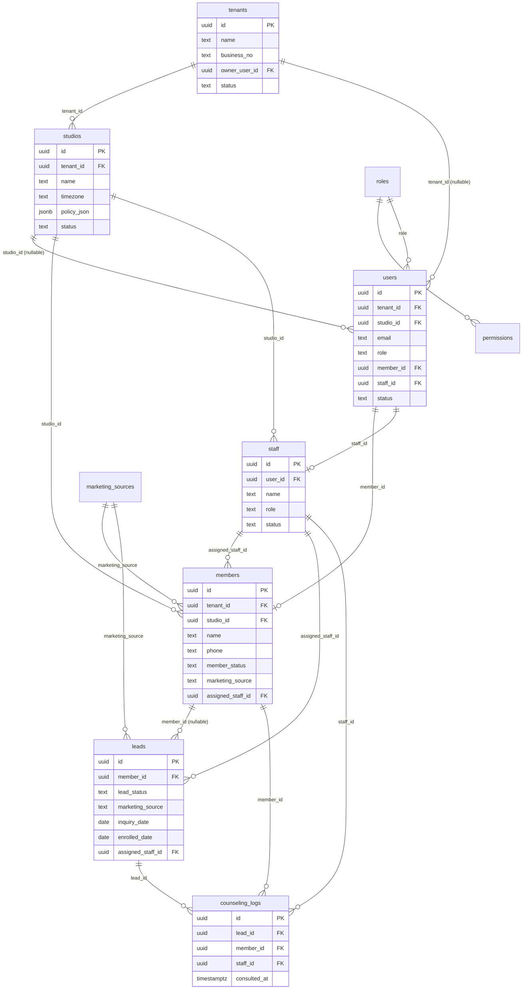
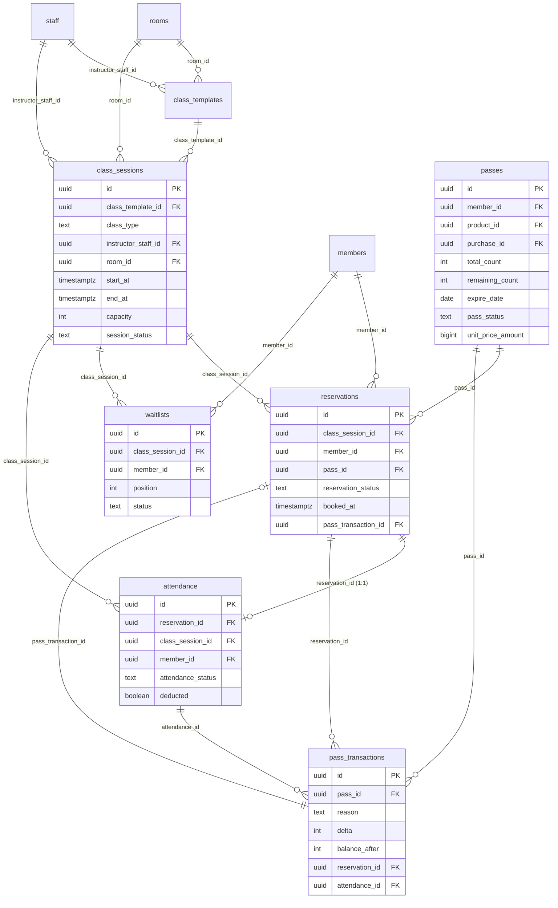
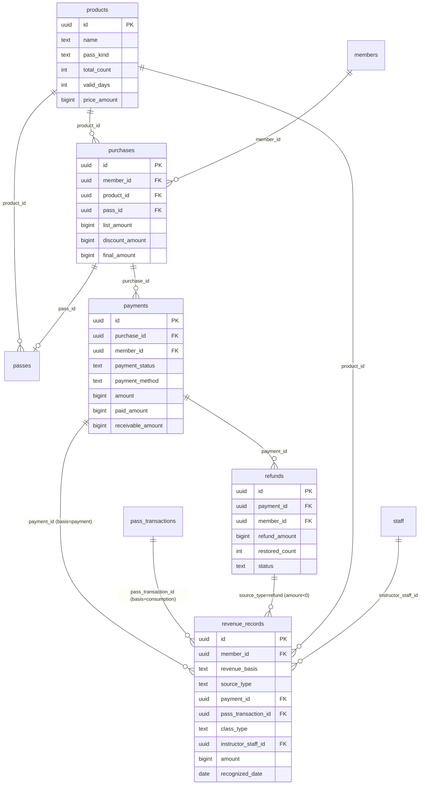
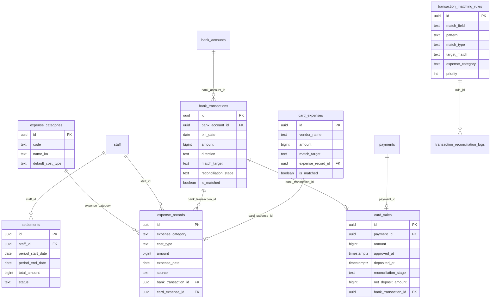
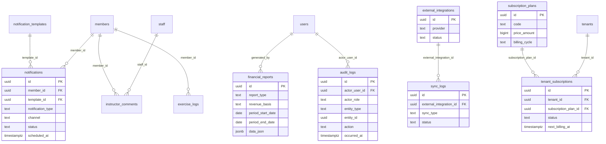

# 11-erd.md — 데이터베이스 ERD 초안

> 목적: 필라테스 경영관리 SaaS의 **전 테이블(42개) 물리 스키마 초안**을 컬럼·타입·PK·FK·인덱스·제약·멀티테넌트 키 단위로 확정하고, 이중 손익 회계 구조와 금융연동 확장 구조를 ERD(Mermaid)로 시각화한다. 본 문서는 [`00-canon.md`](./00-canon.md) §1(네이밍)·§2(엔티티 사전)·§3(enum)·§4(이중 손익)의 **상세화·시각화**일 뿐이며, CANON과 충돌하는 컬럼/타입/enum은 무효다. 모든 테이블·컬럼·enum 값은 CANON과 **글자 단위로 일치**한다.

- 기준 DB: PostgreSQL 15+ (UUIDv7 PK, `timestamptz`, `jsonb`, 부분 인덱스, `gen_random_uuid()` 또는 앱 생성 UUID)
- 근거: [`_source-requirements.md`](./_source-requirements.md) §16(테이블 목록), CANON §2·§3·§4
- 문서 버전: v1.0 / 기준일 2026-06-12

---

## 0. 읽는 법 (표기 규약)

| 표기 | 의미 |
|---|---|
| **PK** | 기본키. 모든 테이블 `id uuid` 단일 PK(UUIDv7 권장, 시간정렬). |
| **FK →** | 외래키 참조. `fk_<table>_<ref>` 제약명. 금전·감사 데이터는 `ON DELETE RESTRICT`(물리 삭제 차단). |
| ★ | 금액 필드. `bigint`, 단위 = 원(KRW), 정수만. 음수 허용 필드는 별도 명시(환불·차감 조정). |
| ◆ | 상태/유형 enum 필드. 저장값 = 영문 snake_case 코드(CANON §3). DB는 `text` + `CHECK` 제약(또는 PG enum)으로 값 집합 강제. |
| `_at` | `timestamptz`(UTC 저장). `_date` | `date`(KST 기준). `_minutes`/`_days` | `int`(분/일). |
| `_json` | `jsonb`. `_amount` | `bigint`. `_rate` | `numeric(7,4)`(0.0000~1.0000). |
| 🔒 | 멀티테넌트 격리 키 (`tenant_id`, `studio_id`). 모든 업무 쿼리 필수 필터. |
| 📜 | append-only(불변) 테이블. `pass_transactions`, `audit_logs` — UPDATE/물리 DELETE 금지. |

### 0.1 공통 컬럼 규약 (CANON §1.2 준수 — 모든 업무 테이블 필수)

아래 7개 공통 컬럼은 **각 테이블 정의에서 반복 기재하지 않고 본 절에서 1회 정의**한다. 후속 테이블 표의 "고유 컬럼"은 이 공통 컬럼을 제외한 것이다.

| 컬럼 | 타입 | 제약 / 기본값 | 설명 |
|---|---|---|---|
| `id` | uuid | **PK**, default UUIDv7 | 전역 고유 식별자(시간정렬). |
| `tenant_id` | uuid | **FK → tenants.id**, NOT NULL | 🔒 테넌트 분리 키. 모든 쿼리 필수 필터. |
| `studio_id` | uuid | **FK → studios.id**, NOT NULL | 🔒 지점 분리 키(테넌트 하위). |
| `created_at` | timestamptz | NOT NULL, default `now()` | 생성 시각(UTC). |
| `updated_at` | timestamptz | NOT NULL, default `now()` | 최종 수정 시각(UTC). 트리거로 자동 갱신. |
| `deleted_at` | timestamptz | NULL | **소프트 삭제** 시각. NULL=활성. **금전·감사 데이터 물리 삭제 금지.** |
| `created_by` | uuid | **FK → users.id**, NULL | 생성 주체. 시스템 생성 시 NULL. |

**공통 규약**

- **소프트 삭제**: 모든 조회는 기본적으로 `WHERE deleted_at IS NULL`. 모든 테이블에 `idx_<table>_tenant_studio (tenant_id, studio_id, deleted_at)` 인덱스를 기본 부여(이하 표에서 "테넌시 인덱스"로 약칭, 별도 표기 생략).
- **타임스탬프**: `_at`은 UTC `timestamptz`, `_date`는 KST 기준 `date`. 정책 판정(예약/취소 마감)은 스튜디오 `timezone` 기준으로 앱에서 계산.
- **테넌시 격리**: 비-글로벌 테이블은 `tenant_id`+`studio_id` NOT NULL. **글로벌 예외**(아래 §1 표기 글로벌🌐): `tenants`, `subscription_plans`(studio_id 미보유), 순수 코드성 테이블은 정의에서 별도 명시.
- **변경 추적 보강**: 변경 추적이 중요한 테이블(`payments`, `passes`, `revenue_records`, `expense_records`, `settlements` 등)은 `updated_by uuid FK → users.id NULL` 선택 추가. 단, **모든 수정/삭제/환불/수강권 차감 변경은 `audit_logs`에 별도 기록**(CANON §5, §2-38).
- **금액 무결성**: 모든 ★금액 컬럼은 `CHECK (... >= 0)` 기본(음수 허용 컬럼만 명시 제외). 비율은 저장하지 않고 조회 시 계산(부득이 시 `_rate numeric(7,4)`).

### 0.2 글로벌 vs 테넌트 테이블 분류

| 분류 | 테이블 | tenant_id | studio_id |
|---|---|---|---|
| 🌐 글로벌(SaaS 코어) | `tenants`, `subscription_plans` | (자기 자신/없음) | 없음 |
| 🌐 테넌트 단위(지점 무관) | `users`, `tenant_subscriptions`, `studios` | 있음 | NULL 허용 |
| 🔒 지점 단위(업무 데이터) | 위 외 전부(36개) | NOT NULL | NOT NULL |

> `users`는 테넌트 소속이되 특정 지점에 묶이지 않을 수 있어 `studio_id` NULL 허용(`saas_admin`은 `tenant_id`도 NULL). `studios`는 테넌트 소속이며 자기 자신이 studio 근원이므로 `studio_id` 없음.

---

## 1. 도메인별 테이블 정의

테이블은 CANON §2의 10개 도메인(A~J) 순서로 정의한다. 각 표는 **고유 컬럼만** 기재(공통 7컬럼은 §0.1 참조). 마지막 열 "비고"에 제약/인덱스 요점을 적는다.

---

### A. 테넌시 · 조직 (SaaS Core)

#### A-1. `tenants` 🌐 — SaaS 계약 단위(브랜드/사업자)

자기 자신이 `tenant_id`의 근원이므로 공통 컬럼 중 `tenant_id`/`studio_id`를 보유하지 않는다(`id`가 곧 테넌트 식별자). `created_at`/`updated_at`/`deleted_at`은 보유.

| 컬럼 | 타입 | 제약 | 비고 |
|---|---|---|---|
| `id` | uuid | PK | 테넌트 식별자 = 모든 하위 데이터의 `tenant_id`. |
| `name` | text | NOT NULL | 브랜드/상호명. |
| `business_no` | text | UNIQUE NULL | 사업자등록번호(하이픈 제거 저장). |
| `owner_user_id` | uuid | FK → users.id NULL | 대표 오너 계정. (순환참조 — DEFERRABLE FK, 가입 트랜잭션에서 해소) |
| ◆`status` | text | NOT NULL CHECK in (`active`,`suspended`,`closed`) default `active` | 계약 상태. |

인덱스: `idx_tenants_status`, `uq_tenants_business_no`.

#### A-2. `studios` 🌐(테넌트 단위) — 물리 지점(샵)

자기 자신이 `studio_id` 근원 → `studio_id` 미보유. `tenant_id` NOT NULL.

| 컬럼 | 타입 | 제약 | 비고 |
|---|---|---|---|
| `name` | text | NOT NULL | 지점명. |
| `timezone` | text | NOT NULL default `Asia/Seoul` | 정책 판정 기준 타임존. |
| `address` | text | NULL | |
| `phone` | text | NULL | |
| ◆`status` | text | NOT NULL CHECK in (`active`,`inactive`) default `active` | |
| `policy_json` | jsonb | NOT NULL default `'{}'` | CANON §6 정책 파라미터 오버라이드(스튜디오 기본값). |

인덱스: `idx_studios_tenant (tenant_id, status)`.

#### A-3. `users` 🌐(테넌트 단위) — 로그인 계정(직원·강사·회원·SaaS관리자 공통 인증)

`tenant_id` NULL 허용(`saas_admin`), `studio_id` NULL 허용.

| 컬럼 | 타입 | 제약 | 비고 |
|---|---|---|---|
| `tenant_id` | uuid | FK → tenants.id **NULL** | saas_admin은 NULL. |
| `studio_id` | uuid | FK → studios.id **NULL** | 지점 비귀속 계정 허용. |
| `email` | text | NOT NULL | 로그인 ID. |
| `phone` | text | NULL | |
| `password_hash` | text | NULL | 소셜/초대 미설정 시 NULL. |
| ◆`role` | text | NOT NULL CHECK in (CANON §3.18 7종) | `saas_admin`/`owner`/`manager`/`info_staff`/`instructor`/`accountant`/`member`. |
| `member_id` | uuid | FK → members.id NULL | 회원 계정 연결. |
| `staff_id` | uuid | FK → staff.id NULL | 직원/강사 연결. |
| ◆`status` | text | NOT NULL CHECK in (`active`,`invited`,`suspended`) default `invited` | |

인덱스: `uq_users_tenant_email (tenant_id, email)`(부분 UNIQUE, `deleted_at IS NULL`), `idx_users_role`, `idx_users_member (member_id)`, `idx_users_staff (staff_id)`.

#### A-4. `roles` 🌐 — 역할 코드 사전 (코드 테이블)

`tenant_id`/`studio_id` 미보유(전역 코드). `id`+`code`.

| 컬럼 | 타입 | 제약 | 비고 |
|---|---|---|---|
| `code` | text | UNIQUE NOT NULL | CANON §3.18 role enum 값. |
| `name_ko` | text | NOT NULL | UI 라벨(예: 샵 오너). |
| `description` | text | NULL | |

인덱스: `uq_roles_code`.

#### A-5. `permissions` 🌐 — 역할×리소스×액션 권한 매핑 (코드 테이블)

| 컬럼 | 타입 | 제약 | 비고 |
|---|---|---|---|
| `role_code` | text | FK → roles.code NOT NULL | |
| `resource` | text | NOT NULL | 예: `members`,`payments`,`revenue`,`bank_transactions`. |
| `action` | text | NOT NULL CHECK in (`read`,`create`,`update`,`delete`,`export`) | |
| `scope` | text | NOT NULL CHECK in (`all`,`assigned`,`own`) default `all` | CANON §5 스코프. |

인덱스: `uq_permissions_role_resource_action_scope (role_code, resource, action, scope)`.

> RBAC 상세 매트릭스는 [`13-rbac.md`](./13-rbac.md)가 소유(CANON §5 확장).

---

### B. 사람 · CRM

#### B-1. `members` 🔒 — 회원 마스터(잠재고객 포함, 전환 시 동일 레코드 승격)

| 컬럼 | 타입 | 제약 | 비고 |
|---|---|---|---|
| `name` | text | NOT NULL | |
| `phone` | text | NOT NULL | 검색·매칭 키. |
| `gender` | text | CHECK in (`male`,`female`,`other`) NULL | |
| `birth_date` | date | NULL | |
| ◆`member_status` | text | NOT NULL CHECK in (CANON §3.1 8종) default `new_inquiry` | `new_inquiry`…`re_enrolled`. |
| `marketing_source` | text | CHECK in (CANON §3.16 7종) NULL | 유입경로 코드(또는 `marketing_sources` 참조). |
| `goal` | text | NULL | 운동 목적. |
| `medical_note` | text | NULL | 통증/주의사항. |
| `memo` | text | NULL | 상담 메모. |
| `assigned_staff_id` | uuid | FK → staff.id NULL | 담당 직원. |

인덱스: `idx_members_phone (tenant_id, studio_id, phone)`, `idx_members_status (tenant_id, studio_id, member_status)`, `idx_members_assigned (assigned_staff_id)`.
태그(CANON §3.17)는 다대다 → `member_tags(member_id, tag)` 보조 테이블 또는 `tags text[]`(MVP). 본 ERD는 `member_tags` 조인 테이블 권장.

#### B-2. `leads` 🔒 — 상담 파이프라인(문의→체험→등록), member 1:N

| 컬럼 | 타입 | 제약 | 비고 |
|---|---|---|---|
| `member_id` | uuid | FK → members.id NULL | 전환 후 연결. |
| `name` | text | NOT NULL | |
| `phone` | text | NOT NULL | |
| ◆`lead_status` | text | NOT NULL CHECK in (CANON §3.2 7종) default `new_inquiry` | |
| `marketing_source` | text | CHECK in (§3.16) NULL | |
| `inquiry_date` | date | NULL | 문의일. |
| `trial_booked_date` | date | NULL | 체험예약일. |
| `trial_done_date` | date | NULL | 체험완료일. |
| `enrolled_date` | date | NULL | 등록일. |
| `lost_reason` | text | NULL | 미등록 사유. |
| `assigned_staff_id` | uuid | FK → staff.id NULL | |

인덱스: `idx_leads_status (tenant_id, studio_id, lead_status)`, `idx_leads_member (member_id)`, `idx_leads_source (marketing_source)`, `idx_leads_inquiry_date (inquiry_date)`(전환율 집계).

#### B-3. `staff` 🔒 — 직원·강사 마스터

| 컬럼 | 타입 | 제약 | 비고 |
|---|---|---|---|
| `user_id` | uuid | FK → users.id NULL | 로그인 계정 연결. |
| `name` | text | NOT NULL | |
| `phone` | text | NULL | |
| ◆`role` | text | NOT NULL CHECK in (`owner`,`manager`,`info_staff`,`instructor`,`accountant`) | 직원 역할(member 제외). |
| `employment_type` | text | CHECK in (`fulltime`,`parttime`,`freelance`) NULL | |
| ◆`status` | text | NOT NULL CHECK in (`active`,`inactive`) default `active` | |
| `available_hours_json` | jsonb | default `'{}'` | 근무 가능 시간. |
| `settlement_method` | text | NULL | 강사료 정산 방식 코드(확장). |

인덱스: `idx_staff_role (tenant_id, studio_id, role)`, `idx_staff_user (user_id)`.

#### B-4. `counseling_logs` 🔒 — 상담 이력(통화/방문/메시지 1건)

| 컬럼 | 타입 | 제약 | 비고 |
|---|---|---|---|
| `lead_id` | uuid | FK → leads.id NULL | |
| `member_id` | uuid | FK → members.id NULL | |
| `staff_id` | uuid | FK → staff.id NULL | 상담 담당. |
| `channel` | text | CHECK in (`call`,`visit`,`message`,`etc`) NULL | |
| `content` | text | NOT NULL | 상담 내용. |
| `consulted_at` | timestamptz | NOT NULL | 상담 시각. |
| `next_action_at` | timestamptz | NULL | 리마인드(상담 후속). |

인덱스: `idx_counseling_lead (lead_id)`, `idx_counseling_member (member_id)`, `idx_counseling_next_action (next_action_at)`(리마인드 큐).

#### B-5. `marketing_sources` 🔒 — 유입경로 코드 사전(샵별 커스텀)

| 컬럼 | 타입 | 제약 | 비고 |
|---|---|---|---|
| `code` | text | NOT NULL | CANON §3.16 marketing_source 값(샵 커스텀 추가 가능). |
| `name_ko` | text | NOT NULL | |
| `is_paid` | boolean | NOT NULL default false | 광고성 여부(CAC 산정). |
| `is_active` | boolean | NOT NULL default true | |

인덱스: `uq_marketing_sources_code (tenant_id, studio_id, code)`.

---

### C. 수업 · 공간 · 예약 · 출석

#### C-1. `rooms` 🔒 — 수업 공간(룸/존)

| 컬럼 | 타입 | 제약 | 비고 |
|---|---|---|---|
| `name` | text | NOT NULL | |
| `capacity` | int | NOT NULL CHECK (capacity >= 0) | 정원. |
| ◆`status` | text | NOT NULL CHECK in (`active`,`inactive`) default `active` | |

인덱스: `idx_rooms_status (tenant_id, studio_id, status)`.

#### C-2. `class_templates` 🔒 — 정규/반복 수업 설계 템플릿

| 컬럼 | 타입 | 제약 | 비고 |
|---|---|---|---|
| ◆`class_type` | text | NOT NULL CHECK in (`personal`,`group`,`trial`) | CANON §3.3. |
| `name` | text | NOT NULL | |
| `instructor_staff_id` | uuid | FK → staff.id NULL | 담당 강사. |
| `room_id` | uuid | FK → rooms.id NULL | |
| `capacity` | int | NOT NULL CHECK (capacity >= 0) | |
| `duration_minutes` | int | NOT NULL CHECK (duration_minutes > 0) | 수업 길이. |
| `recurrence_rule` | text | NULL | RRULE(반복 규칙). |
| `is_public` | boolean | NOT NULL default true | 공개/비공개. |
| `booking_open_days` | int | NULL | 정책 오버라이드(§6.1). |
| `booking_close_minutes` | int | NULL | 정책 오버라이드. |
| `cancel_deadline_minutes` | int | NULL | 정책 오버라이드. |

인덱스: `idx_class_templates_instructor (instructor_staff_id)`, `idx_class_templates_type (tenant_id, studio_id, class_type)`.

#### C-3. `class_sessions` 🔒 — 실제 발생 수업 회차(예약·출석 기준)

| 컬럼 | 타입 | 제약 | 비고 |
|---|---|---|---|
| `class_template_id` | uuid | FK → class_templates.id NULL | 단일수업은 NULL. |
| ◆`class_type` | text | NOT NULL CHECK in (`personal`,`group`,`trial`) | |
| `instructor_staff_id` | uuid | FK → staff.id NULL | |
| `room_id` | uuid | FK → rooms.id NULL | |
| `start_at` | timestamptz | NOT NULL | 회차 시작(UTC). |
| `end_at` | timestamptz | NOT NULL CHECK (end_at > start_at) | 반열림 [start,end). |
| `capacity` | int | NOT NULL CHECK (capacity >= 0) | |
| `waitlist_capacity` | int | NOT NULL default 0 | 대기 정원. |
| ◆`session_status` | text | NOT NULL CHECK in (CANON §3.4 5종) default `scheduled` | `scheduled`/`open`/`closed`/`canceled`/`completed`. |
| `is_public` | boolean | NOT NULL default true | |
| `substitute_staff_id` | uuid | FK → staff.id NULL | 대체 강사. |

인덱스: `idx_class_sessions_start (tenant_id, studio_id, start_at)`(캘린더), `idx_class_sessions_instructor_start (instructor_staff_id, start_at)`, `idx_class_sessions_status (session_status)`, `idx_class_sessions_template (class_template_id)`.
제약: 룸 동시수업 충돌은 앱/배치에서 검증(겹침 방지 — `room_id`+시간범위 exclusion 제약 선택: `EXCLUDE USING gist`).

#### C-4. `reservations` 🔒 — 회원의 회차 예약 1건(차감·출석 연결점)

| 컬럼 | 타입 | 제약 | 비고 |
|---|---|---|---|
| `class_session_id` | uuid | FK → class_sessions.id NOT NULL | |
| `member_id` | uuid | FK → members.id NOT NULL | |
| `pass_id` | uuid | FK → passes.id NULL | 차감 대상 수강권. |
| ◆`reservation_status` | text | NOT NULL CHECK in (CANON §3.5 6종) default `booked` | `booked`/`waitlisted`/`attended`/`absent`/`no_show`/`canceled`. |
| `booked_at` | timestamptz | NOT NULL | |
| `canceled_at` | timestamptz | NULL | |
| `cancel_reason` | text | NULL | 정상/지각취소 구분 메타. |
| `is_self_booked` | boolean | NOT NULL default false | 회원 직접 vs 대리. |
| `pass_transaction_id` | uuid | FK → pass_transactions.id NULL | 차감/복구 연결. |

인덱스: `idx_reservations_session_status (class_session_id, reservation_status)`(정원 카운트·CANON 예시), `idx_reservations_member (member_id, booked_at)`, `idx_reservations_pass (pass_id)`, **부분 UNIQUE** `uq_reservations_active (class_session_id, member_id) WHERE reservation_status IN ('booked','waitlisted','attended') AND deleted_at IS NULL`(동일 회차 중복 예약 차단).

#### C-5. `waitlists` 🔒 — 정원 초과 대기 큐(자동 전환 대상)

| 컬럼 | 타입 | 제약 | 비고 |
|---|---|---|---|
| `class_session_id` | uuid | FK → class_sessions.id NOT NULL | |
| `member_id` | uuid | FK → members.id NOT NULL | |
| `pass_id` | uuid | FK → passes.id NULL | |
| `position` | int | NOT NULL CHECK (position > 0) | 대기 순번. |
| ◆`status` | text | NOT NULL CHECK in (`waiting`,`promoted`,`canceled`,`expired`) default `waiting` | |
| `requested_at` | timestamptz | NOT NULL | |
| `promoted_at` | timestamptz | NULL | 자동전환 시각. |

인덱스: `idx_waitlists_session_position (class_session_id, position) WHERE status='waiting'`, `idx_waitlists_member (member_id)`, **부분 UNIQUE** `uq_waitlists_active (class_session_id, member_id) WHERE status='waiting' AND deleted_at IS NULL`.

#### C-6. `attendance` 🔒 — 출석 처리 결과(reservation 1:1)

| 컬럼 | 타입 | 제약 | 비고 |
|---|---|---|---|
| `reservation_id` | uuid | FK → reservations.id NOT NULL | |
| `class_session_id` | uuid | FK → class_sessions.id NOT NULL | |
| `member_id` | uuid | FK → members.id NOT NULL | |
| ◆`attendance_status` | text | NOT NULL CHECK in (CANON §3.6 5종) | `attended`/`late`/`absent`/`no_show`/`excused`. |
| `checked_at` | timestamptz | NULL | 체크 시각. |
| `checked_by` | uuid | FK → users.id NULL | 처리자. |
| `deducted` | boolean | NOT NULL default false | 차감 여부(정책·excused 반영). |

인덱스: **UNIQUE** `uq_attendance_reservation (reservation_id) WHERE deleted_at IS NULL`(1:1 보장), `idx_attendance_session (class_session_id)`, `idx_attendance_member_status (member_id, attendance_status)`(노쇼율 집계).

---

### D. 상품 · 수강권 · 차감

#### D-1. `products` 🔒 — 판매 상품(수강권 정의)

| 컬럼 | 타입 | 제약 | 비고 |
|---|---|---|---|
| `name` | text | NOT NULL | |
| ◆`pass_kind` | text | NOT NULL CHECK in (`personal`,`group`,`trial`,`package`) | CANON §3.7. |
| `total_count` | int | CHECK (total_count > 0) NULL | 횟수(NULL=무제한 부적용). |
| `valid_days` | int | NOT NULL CHECK (valid_days > 0) | 유효기간(일). |
| ★`price_amount` | bigint | NOT NULL CHECK (price_amount >= 0) | 정가(원). |
| `allowed_class_types` | jsonb | NOT NULL default `'[]'` | 사용 가능 수업 유형(personal/group/trial). |
| `holdable` | boolean | NOT NULL default true | 정지 가능. |
| `max_hold_days` | int | NULL | 최대 정지일. |

인덱스: `idx_products_kind (tenant_id, studio_id, pass_kind)`.

#### D-2. `passes` 🔒 — 회원 보유 개별 수강권 인스턴스

| 컬럼 | 타입 | 제약 | 비고 |
|---|---|---|---|
| `member_id` | uuid | FK → members.id NOT NULL | |
| `product_id` | uuid | FK → products.id NOT NULL | |
| `purchase_id` | uuid | FK → purchases.id NULL | 발급 근거 구매. |
| ◆`pass_kind` | text | NOT NULL CHECK in (§3.7) | |
| `total_count` | int | NOT NULL CHECK (total_count >= 0) | 발급 총횟수. |
| `remaining_count` | int | NOT NULL CHECK (remaining_count >= 0) | 잔여(원장은 `pass_transactions` 합으로 검증). |
| `start_date` | date | NOT NULL | |
| `expire_date` | date | NOT NULL CHECK (expire_date >= start_date) | |
| ◆`pass_status` | text | NOT NULL CHECK in (CANON §3.8 5종) default `active` | `active`/`paused`/`expired`/`refunded`/`used_up`. |
| `paused_at` | timestamptz | NULL | 정지 시작. |
| `paused_days_used` | int | NOT NULL default 0 | 누적 정지일(max_hold_days 대비). |
| ★`unit_price_amount` | bigint | NOT NULL CHECK (unit_price_amount >= 0) | **소진기준 단가 = round(purchases.final_amount / total_count)**, 발급 시 고정(CANON §4.2). |

인덱스: `idx_passes_member_status (member_id, pass_status)`, `idx_passes_expire (tenant_id, studio_id, expire_date) WHERE pass_status='active'`(만료임박 배치), `idx_passes_remaining (remaining_count) WHERE pass_status='active'`(잔여부족 알림).
무결성: `remaining_count` ≤ `total_count`. `remaining_count`는 `pass_transactions.balance_after` 최신값과 일치해야 함(정합성 배치 검증).

#### D-3. `pass_transactions` 🔒 📜 — 수강권 횟수 증감 원장(append-only)

| 컬럼 | 타입 | 제약 | 비고 |
|---|---|---|---|
| `pass_id` | uuid | FK → passes.id NOT NULL | |
| `member_id` | uuid | FK → members.id NOT NULL | |
| ◆`reason` | text | NOT NULL CHECK in (CANON §3.9 6종) | `deduct_booking`/`deduct_attend`/`restore_cancel`/`restore_close`/`manual_deduct`/`manual_restore`. |
| `delta` | int | NOT NULL CHECK (delta <> 0) | 음수=차감, 양수=복구. |
| `balance_after` | int | NOT NULL CHECK (balance_after >= 0) | 처리 후 잔여. |
| `reservation_id` | uuid | FK → reservations.id NULL | 예약 연결. |
| `attendance_id` | uuid | FK → attendance.id NULL | 출석 연결. |
| `memo` | text | NULL | 수동조정 사유. |

**📜 append-only**: UPDATE/물리 DELETE 금지, `deleted_at` 미사용(정정은 반대 부호 신규 레코드). 인덱스: `idx_pass_txn_pass (pass_id, created_at)`, `idx_pass_txn_member (member_id)`, `idx_pass_txn_reservation (reservation_id)`.
> `delta` 부호는 `reason`과 정합(deduct_*/manual_deduct<0, restore_*/manual_restore>0) — 앱 검증.

---

### E. 결제 · 환불 · 매출 (이중 손익 핵심)

#### E-1. `purchases` 🔒 — 구매 주문(1구매=1수강권 발급 기본)

| 컬럼 | 타입 | 제약 | 비고 |
|---|---|---|---|
| `member_id` | uuid | FK → members.id NOT NULL | |
| `product_id` | uuid | FK → products.id NOT NULL | |
| `pass_id` | uuid | FK → passes.id NULL | 발급 결과. |
| ★`list_amount` | bigint | NOT NULL CHECK (list_amount >= 0) | 정가. |
| ★`discount_amount` | bigint | NOT NULL default 0 CHECK (discount_amount >= 0) | 할인. |
| ★`final_amount` | bigint | NOT NULL CHECK (final_amount >= 0) | 실판매가 = list − discount. |
| `purchased_at` | timestamptz | NOT NULL | |
| `seller_staff_id` | uuid | FK → staff.id NULL | 판매 담당. |

인덱스: `idx_purchases_member (member_id, purchased_at)`, `idx_purchases_product (product_id)`.
무결성: `final_amount = list_amount − discount_amount`(앱 검증). `unit_price_amount`(passes) 산정 근거.

#### E-2. `payments` 🔒 — 결제 기록(수단·승인·입금대기·미수 포함)

| 컬럼 | 타입 | 제약 | 비고 |
|---|---|---|---|
| `purchase_id` | uuid | FK → purchases.id NOT NULL | |
| `member_id` | uuid | FK → members.id NOT NULL | |
| ◆`payment_status` | text | NOT NULL CHECK in (CANON §3.10 5종) default `paid` | `paid`/`awaiting_deposit`/`partial`/`receivable`/`refunded`. |
| ◆`payment_method` | text | NOT NULL CHECK in (CANON §3.11 4종) | `card_onsite`/`transfer`/`cash`/`online`. |
| ★`amount` | bigint | NOT NULL CHECK (amount >= 0) | 결제 청구액. |
| ★`paid_amount` | bigint | NOT NULL default 0 CHECK (paid_amount >= 0) | 실수령액(결제기준 매출 인식액, §4.1). |
| `paid_at` | timestamptz | NULL | 결제/입금 확정 시각. |
| `card_approval_no` | text | NULL | 카드 승인번호. |
| `depositor_name` | text | NULL | 입금자명(통장 매칭 키). |
| `payment_provider` | text | NULL | PG 대비(2~3차). |
| `external_payment_id` | text | NULL | PG 거래 ID. |
| `receivable_amount` | bigint | NOT NULL default 0 CHECK (receivable_amount >= 0) | 미수금 = amount − paid_amount. |
| `staff_id` | uuid | FK → staff.id NULL | 결제 담당. |
| `memo` | text | NULL | |

인덱스: `idx_payments_member (member_id, paid_at)`, `idx_payments_status (tenant_id, studio_id, payment_status)`, `idx_payments_receivable (tenant_id, studio_id) WHERE payment_status IN ('receivable','partial')`(미수금 집계), `idx_payments_depositor (depositor_name)`(통장 매칭), `idx_payments_purchase (purchase_id)`.
무결성: `receivable_amount = amount − paid_amount`. 변경 추적: `updated_by` 보강. 모든 변경 → `audit_logs`.

#### E-3. `refunds` 🔒 — 환불 기록(부분/전액·잔여횟수 회수)

| 컬럼 | 타입 | 제약 | 비고 |
|---|---|---|---|
| `payment_id` | uuid | FK → payments.id NOT NULL | |
| `purchase_id` | uuid | FK → purchases.id NOT NULL | |
| `member_id` | uuid | FK → members.id NOT NULL | |
| ★`refund_amount` | bigint | NOT NULL CHECK (refund_amount >= 0) | 환불액. |
| `refund_reason` | text | NULL | |
| `refunded_at` | timestamptz | NULL | |
| `restored_count` | int | NOT NULL default 0 | 회수(복구된 잔여 차감) 회수. |
| ◆`status` | text | NOT NULL CHECK in (`requested`,`completed`,`canceled`) default `requested` | |
| ◆`refund_method` | text | CHECK in (`card_onsite`,`transfer`,`cash`,`online`) NULL | §3.11 준용. |
| `staff_id` | uuid | FK → staff.id NULL | |

인덱스: `idx_refunds_payment (payment_id)`, `idx_refunds_member (member_id, refunded_at)`, `idx_refunds_status (status)`.
연동: 완료 시 결제기준 매출에 `revenue_records`(basis=`payment`, source=`refund`, amount 음수) 1건 생성(§4.1).

#### E-4. `revenue_records` 🔒 — **매출 인식 원장(이중 손익 핵심, CANON §4)**

> **한 결제 = 결제기준 1건**, **소진될 때마다 소진기준 N건**. `revenue_basis`로 분리하며 두 기준을 **합산하지 않는다**(기준별로만 SUM). 환불·소진 조정은 `amount` 음수 허용.

| 컬럼 | 타입 | 제약 | 비고 |
|---|---|---|---|
| `member_id` | uuid | FK → members.id NOT NULL | |
| ◆`revenue_basis` | text | NOT NULL CHECK in (`payment`,`consumption`) | CANON §3.12·§4. |
| `source_type` | text | NOT NULL CHECK in (`payment`,`refund`,`consumption`) | 인식 출처. |
| `payment_id` | uuid | FK → payments.id NULL | 결제기준 연결. |
| `pass_transaction_id` | uuid | FK → pass_transactions.id NULL | 소진기준 연결. |
| `product_id` | uuid | FK → products.id NULL | |
| ◆`class_type` | text | CHECK in (`personal`,`group`,`trial`) NULL | 소진기준 분해 근거. |
| `instructor_staff_id` | uuid | FK → staff.id NULL | 강사별 수익성(소진기준). |
| `marketing_source` | text | CHECK in (§3.16) NULL | 유입경로별 매출. |
| ★`amount` | bigint | NOT NULL | **음수 허용**(환불·차감 조정). CHECK 없음. |
| `recognized_at` | timestamptz | NOT NULL | 인식 시각(UTC). |
| `recognized_date` | date | NOT NULL | 인식일(KST, 월별 집계 키). |
| `is_new_member` | boolean | NOT NULL default false | 신규회원 매출. |
| `is_re_enroll` | boolean | NOT NULL default false | 재등록 매출. |

인덱스: `idx_revenue_basis_date (tenant_id, studio_id, revenue_basis, recognized_date)`(대시보드 핵심), `idx_revenue_instructor (instructor_staff_id, recognized_date) WHERE revenue_basis='consumption'`, `idx_revenue_class_type (class_type, recognized_date) WHERE revenue_basis='consumption'`, `idx_revenue_source (marketing_source, recognized_date)`, `idx_revenue_payment (payment_id)`, `idx_revenue_pass_txn (pass_transaction_id)`.

**인식 산식 요약(CANON §4 — [`19-metrics.md`](./19-metrics.md) 상세 소유)**

```
결제기준(payment):  amount = payments.paid_amount,  recognized_at = paid_at
환불(payment):      amount = -refunds.refund_amount (source_type='refund')
소진기준(consumption): amount = passes.unit_price_amount, recognized_at = pass_transaction.created_at
순매출 = Σ revenue_records.amount  (선택 basis, 환불 음수 포함)
```

---

### F. 비용 · 정산

#### F-1. `expense_records` 🔒 — 비용 인식 원장(통장 출금·카드 사용·수동 통합)

| 컬럼 | 타입 | 제약 | 비고 |
|---|---|---|---|
| ◆`expense_category` | text | NOT NULL CHECK in (CANON §3.13 17종) | `rent`…`etc`. |
| ◆`cost_type` | text | NOT NULL CHECK in (`fixed`,`variable`) | CANON §3.14. |
| ★`amount` | bigint | NOT NULL CHECK (amount >= 0) | 비용액. |
| `vendor_name` | text | NULL | 거래처. |
| `expense_date` | date | NOT NULL | 비용 발생일(월별 집계 키). |
| `source` | text | NOT NULL CHECK in (`bank`,`card`,`manual`) | 출처. |
| `bank_transaction_id` | uuid | FK → bank_transactions.id NULL | 통장 연결. |
| `card_expense_id` | uuid | FK → card_expenses.id NULL | 카드 연결. |
| `is_recurring` | boolean | NOT NULL default false | 반복 비용. |
| `receipt_file_url` | text | NULL | 증빙 파일. |
| `doc_memo` | text | NULL | 세금계산서/영수증 메모. |
| `staff_id` | uuid | FK → staff.id NULL | 강사료 귀속 시. |

인덱스: `idx_expense_category_date (tenant_id, studio_id, expense_category, expense_date)`, `idx_expense_cost_type (cost_type, expense_date)`(고정/변동 집계), `idx_expense_source (source)`, `idx_expense_bank_txn (bank_transaction_id)`, `idx_expense_card (card_expense_id)`.

#### F-2. `expense_categories` 🔒 — 비용 카테고리 사전(17종 기본 + 커스텀)

| 컬럼 | 타입 | 제약 | 비고 |
|---|---|---|---|
| `code` | text | NOT NULL | CANON §3.13 expense_category 값. |
| `name_ko` | text | NOT NULL | |
| ◆`default_cost_type` | text | NOT NULL CHECK in (`fixed`,`variable`) | 기본 성격(§3.13 매핑). |
| `is_active` | boolean | NOT NULL default true | |
| `sort_order` | int | NOT NULL default 0 | UI 정렬. |

인덱스: `uq_expense_categories_code (tenant_id, studio_id, code)`.
> 17종 기본값과 default_cost_type 매핑은 CANON §3.13 표 그대로 시드. 상세 운영 규칙은 [`18-expense-category-policy.md`](./18-expense-category-policy.md).

#### F-3. `settlements` 🔒 — 강사/직원 정산 집계(기간별)

| 컬럼 | 타입 | 제약 | 비고 |
|---|---|---|---|
| `staff_id` | uuid | FK → staff.id NOT NULL | |
| `period_start_date` | date | NOT NULL | |
| `period_end_date` | date | NOT NULL CHECK (period_end_date >= period_start_date) | |
| `session_count` | int | NOT NULL default 0 | 출석 기준 수업 수. |
| ★`base_amount` | bigint | NOT NULL default 0 | 기본 강사료. |
| ★`bonus_amount` | bigint | NOT NULL default 0 | 인센티브. |
| ★`deduction_amount` | bigint | NOT NULL default 0 | 공제. |
| ★`total_amount` | bigint | NOT NULL default 0 | base + bonus − deduction. |
| ◆`status` | text | NOT NULL CHECK in (`draft`,`confirmed`,`paid`) default `draft` | |
| `confirmed_at` | timestamptz | NULL | |
| `paid_at` | timestamptz | NULL | |

인덱스: `idx_settlements_staff_period (staff_id, period_start_date)`, `idx_settlements_status (status)`.
연동: 확정/지급 시 `expense_records`(category=`instructor_fee`, cost_type=`variable`) 생성 가능.

---

### G. 금융 연동 · 거래 매칭 (2~3차 확장 — MVP는 CSV/수동)

#### G-1. `bank_accounts` 🔒 — 사업자 통장 계좌(오픈뱅킹 대비)

| 컬럼 | 타입 | 제약 | 비고 |
|---|---|---|---|
| `bank_code` | text | NOT NULL | 은행 코드. |
| `account_no_masked` | text | NOT NULL | 마스킹 계좌번호. |
| `account_holder` | text | NULL | 예금주. |
| ★`balance_amount` | bigint | NOT NULL default 0 | 현재 잔액 스냅샷. |
| `last_synced_at` | timestamptz | NULL | |
| ◆`status` | text | NOT NULL CHECK in (`active`,`inactive`) default `active` | |
| `is_open_banking_linked` | boolean | NOT NULL default false | |

인덱스: `idx_bank_accounts_status (tenant_id, studio_id, status)`.

#### G-2. `bank_transactions` 🔒 — 통장 입출금 거래내역(CSV/오픈뱅킹)

| 컬럼 | 타입 | 제약 | 비고 |
|---|---|---|---|
| `bank_account_id` | uuid | FK → bank_accounts.id NOT NULL | |
| `txn_date` | date | NOT NULL | 거래일. |
| ★`amount` | bigint | NOT NULL | **음수 허용**(입금+/출금−). CHECK 없음. |
| `direction` | text | NOT NULL CHECK in (`deposit`,`withdraw`) | |
| `counterparty_name` | text | NULL | 입금자/출금처명(매칭 키). |
| `balance_after_amount` | bigint | NULL | 거래 후 잔액. |
| ◆`match_target` | text | CHECK in (CANON §3.19) NULL | `revenue`/`expense`/`transfer`/`etc`. |
| `matched_ref_type` | text | NULL | 연결 대상 타입(payment/expense/transfer). |
| `matched_ref_id` | uuid | NULL | 연결 대상 id. |
| ◆`reconciliation_stage` | text | CHECK in (`approved`,`captured`,`deposited`) NULL | 카드매출 입금 매칭 시(§3.21). |
| `is_matched` | boolean | NOT NULL default false | |
| `import_batch_id` | uuid | NULL | CSV 업로드 배치. |

인덱스: `idx_bank_txn_date (tenant_id, studio_id, txn_date)`, `idx_bank_txn_unmatched (tenant_id, studio_id) WHERE is_matched=false`(미매칭 목록), `idx_bank_txn_counterparty (counterparty_name)`(자동매칭), `idx_bank_txn_batch (import_batch_id)`.

#### G-3. `card_sales` 🔒 — 카드 매출 내역(승인일/매입일/입금일 3단계)

| 컬럼 | 타입 | 제약 | 비고 |
|---|---|---|---|
| `payment_id` | uuid | FK → payments.id NULL | 현장결제 연결. |
| `approval_no` | text | NULL | 승인번호. |
| ★`amount` | bigint | NOT NULL CHECK (amount >= 0) | 매출 총액. |
| `approved_at` | timestamptz | NOT NULL | 승인일. |
| `captured_at` | timestamptz | NULL | 매입일. |
| `deposited_at` | timestamptz | NULL | 입금일. |
| ◆`reconciliation_stage` | text | NOT NULL CHECK in (`approved`,`captured`,`deposited`) default `approved` | CANON §3.21. |
| ★`fee_amount` | bigint | NOT NULL default 0 | 카드수수료. |
| ★`net_deposit_amount` | bigint | NOT NULL default 0 | 실입금 = amount − fee. |
| `bank_transaction_id` | uuid | FK → bank_transactions.id NULL | 입금 매칭. |

인덱스: `idx_card_sales_stage (tenant_id, studio_id, reconciliation_stage)`(미입금 추적), `idx_card_sales_approved (approved_at)`, `idx_card_sales_payment (payment_id)`, `idx_card_sales_undeposited (tenant_id, studio_id) WHERE reconciliation_stage <> 'deposited'`.
산식: 미입금 카드매출 = Σ`net_deposit_amount` where `reconciliation_stage <> 'deposited'`(CANON §4.4).

#### G-4. `card_expenses` 🔒 — 사업자 카드 사용(지출) 내역(CSV/카드사 조회)

| 컬럼 | 타입 | 제약 | 비고 |
|---|---|---|---|
| `card_no_masked` | text | NOT NULL | 마스킹 카드번호. |
| `vendor_name` | text | NULL | 가맹점(자동분류 키). |
| ★`amount` | bigint | NOT NULL CHECK (amount >= 0) | 사용액. |
| `used_at` | timestamptz | NOT NULL | 사용일. |
| `billed_at` | timestamptz | NULL | 청구일. |
| ◆`match_target` | text | CHECK in (CANON §3.19) NULL | |
| `expense_record_id` | uuid | FK → expense_records.id NULL | 분류 결과. |
| `is_matched` | boolean | NOT NULL default false | |
| `import_batch_id` | uuid | NULL | CSV 배치. |

인덱스: `idx_card_exp_used (tenant_id, studio_id, used_at)`, `idx_card_exp_unmatched (tenant_id, studio_id) WHERE is_matched=false`, `idx_card_exp_vendor (vendor_name)`(자동분류), `idx_card_exp_batch (import_batch_id)`.

#### G-5. `transaction_matching_rules` 🔒 — 거래처명 기반 자동 분류 규칙

> CANON/원본: **관리자가 수정한 분류 규칙은 다음 거래부터 자동 적용**.

| 컬럼 | 타입 | 제약 | 비고 |
|---|---|---|---|
| `match_field` | text | NOT NULL CHECK in (`counterparty_name`,`vendor_name`) | 적용 대상 필드. |
| `pattern` | text | NOT NULL | 문자열/정규식. |
| `match_type` | text | NOT NULL CHECK in (`exact`,`contains`,`regex`) | |
| ◆`target_match` | text | NOT NULL CHECK in (CANON §3.19) | `revenue`/`expense`/`transfer`/`etc`. |
| ◆`expense_category` | text | CHECK in (§3.13) NULL | 비용 분류 시. |
| ◆`cost_type` | text | CHECK in (`fixed`,`variable`) NULL | |
| `priority` | int | NOT NULL default 100 | 낮을수록 우선. |
| `is_active` | boolean | NOT NULL default true | |

인덱스: `idx_match_rules_active (tenant_id, studio_id, priority) WHERE is_active=true`, `idx_match_rules_field (match_field)`.

#### G-6. `transaction_reconciliation_logs` 🔒 — 거래 매칭/분류 처리 이력

| 컬럼 | 타입 | 제약 | 비고 |
|---|---|---|---|
| `txn_type` | text | NOT NULL CHECK in (`bank`,`card_sale`,`card_expense`) | 대상 거래 종류. |
| `txn_id` | uuid | NOT NULL | 대상 거래 id(다형 참조). |
| `action` | text | NOT NULL CHECK in (`auto_matched`,`manual_matched`,`unmatched`,`reclassified`) | |
| `before_json` | jsonb | NULL | 변경 전. |
| `after_json` | jsonb | NULL | 변경 후. |
| `rule_id` | uuid | FK → transaction_matching_rules.id NULL | 적용 규칙. |
| `staff_id` | uuid | FK → staff.id NULL | 처리자. |
| `processed_at` | timestamptz | NOT NULL | |

인덱스: `idx_recon_logs_txn (txn_type, txn_id)`, `idx_recon_logs_processed (tenant_id, studio_id, processed_at)`, `idx_recon_logs_rule (rule_id)`.

---

### H. 알림 · 운동기록 · 강사코멘트

#### H-1. `notification_templates` 🔒 — 알림 템플릿(13종 유형)

| 컬럼 | 타입 | 제약 | 비고 |
|---|---|---|---|
| ◆`notification_type` | text | NOT NULL CHECK in (CANON §3.20 13종) | `reservation_done`…`counseling_reminder`. |
| `channel` | text | NOT NULL CHECK in (`sms`,`kakao`,`push`,`email`) | |
| `title` | text | NULL | |
| `body_template` | text | NOT NULL | 변수치환 본문. |
| `is_active` | boolean | NOT NULL default true | |

인덱스: `idx_noti_templates_type (tenant_id, studio_id, notification_type, channel)`.

#### H-2. `notifications` 🔒 — 발송/예약 알림 1건(이력)

| 컬럼 | 타입 | 제약 | 비고 |
|---|---|---|---|
| `member_id` | uuid | FK → members.id NULL | |
| `template_id` | uuid | FK → notification_templates.id NULL | |
| ◆`notification_type` | text | NOT NULL CHECK in (§3.20) | |
| `channel` | text | NOT NULL CHECK in (`sms`,`kakao`,`push`,`email`) | |
| ◆`status` | text | NOT NULL CHECK in (`scheduled`,`sent`,`failed`,`canceled`) default `scheduled` | |
| `scheduled_at` | timestamptz | NULL | 예약 발송 시각. |
| `sent_at` | timestamptz | NULL | |
| `payload_json` | jsonb | default `'{}'` | 치환 변수/렌더 결과. |
| `error_message` | text | NULL | |

인덱스: `idx_noti_scheduled (tenant_id, studio_id, scheduled_at) WHERE status='scheduled'`(발송 큐), `idx_noti_member (member_id)`, `idx_noti_type_status (notification_type, status)`.

#### H-3. `instructor_comments` 🔒 — 강사 회원별 코멘트(권한 분리 대상)

| 컬럼 | 타입 | 제약 | 비고 |
|---|---|---|---|
| `member_id` | uuid | FK → members.id NOT NULL | |
| `staff_id` | uuid | FK → staff.id NOT NULL | 작성 강사. |
| `class_session_id` | uuid | FK → class_sessions.id NULL | |
| `content` | text | NOT NULL | |
| `commented_at` | timestamptz | NOT NULL | |

인덱스: `idx_instr_comments_member (member_id, commented_at)`, `idx_instr_comments_staff (staff_id)`.
> 강사는 담당(assigned) 회원만 작성/조회(CANON §5 scope).

#### H-4. `exercise_logs` 🔒 — 회원 운동일지(2차 기능)

| 컬럼 | 타입 | 제약 | 비고 |
|---|---|---|---|
| `member_id` | uuid | FK → members.id NOT NULL | |
| `class_session_id` | uuid | FK → class_sessions.id NULL | |
| `staff_id` | uuid | FK → staff.id NULL | |
| `content` | text | NULL | |
| `metrics_json` | jsonb | default `'{}'` | 수행 지표. |
| `logged_at` | timestamptz | NOT NULL | |

인덱스: `idx_exercise_logs_member (member_id, logged_at)`, `idx_exercise_logs_session (class_session_id)`.

---

### I. 리포트 · 감사 · 외부연동

#### I-1. `financial_reports` 🔒 — 재무/손익 리포트 스냅샷(월말 마감·세무 공유)

| 컬럼 | 타입 | 제약 | 비고 |
|---|---|---|---|
| `report_type` | text | NOT NULL CHECK in (`monthly_pl`,`cashflow`,`tax_export`,`etc`) | |
| ◆`revenue_basis` | text | CHECK in (`payment`,`consumption`) NULL | 손익 기준(이중). |
| `period_start_date` | date | NOT NULL | |
| `period_end_date` | date | NOT NULL CHECK (period_end_date >= period_start_date) | |
| `data_json` | jsonb | NOT NULL default `'{}'` | 집계 결과 스냅샷. |
| `generated_at` | timestamptz | NOT NULL | |
| `generated_by` | uuid | FK → users.id NULL | |
| `export_file_url` | text | NULL | 내보내기 파일. |

인덱스: `idx_fin_reports_period (tenant_id, studio_id, report_type, period_start_date)`.

#### I-2. `audit_logs` 🔒 📜 — 감사 로그(모든 수정/삭제/환불/수강권 차감 기록; CANON §1·§5 필수)

> **append-only, `deleted_at` 미사용.** 금전·권한 변경 추적의 단일 진실. 원본 §14: 모든 수정/삭제/환불/수강권 차감 변경 기록.

| 컬럼 | 타입 | 제약 | 비고 |
|---|---|---|---|
| `actor_user_id` | uuid | FK → users.id NULL | 행위 주체(시스템 NULL). |
| ◆`actor_role` | text | CHECK in (CANON §3.18 7종) NULL | 행위 시점 역할. |
| `entity_type` | text | NOT NULL | 대상 테이블명. |
| `entity_id` | uuid | NOT NULL | 대상 레코드 id. |
| `action` | text | NOT NULL CHECK in (`create`,`update`,`delete`,`refund`,`pass_adjust`,`match`,`login`,`export`) | |
| `before_json` | jsonb | NULL | 변경 전. |
| `after_json` | jsonb | NULL | 변경 후. |
| `ip_address` | inet | NULL | |
| `occurred_at` | timestamptz | NOT NULL | |

인덱스: `idx_audit_entity (tenant_id, studio_id, entity_type, entity_id)`, `idx_audit_actor (actor_user_id, occurred_at)`, `idx_audit_action (action, occurred_at)`.
> `audit_logs`는 공통 컬럼 중 `deleted_at`/`updated_at`/`updated_by`를 사용하지 않는다(불변). `created_at`=`occurred_at` 동등.

#### I-3. `external_integrations` 🔒 — 외부 서비스 연동 설정

| 컬럼 | 타입 | 제약 | 비고 |
|---|---|---|---|
| `provider` | text | NOT NULL CHECK in (`open_banking`,`pg`,`kakao_alimtalk`,`card_lookup`,`hometax`) | |
| `credential_ref` | text | NULL | 시크릿 저장소 참조(평문 금지). |
| ◆`status` | text | NOT NULL CHECK in (`connected`,`disconnected`,`error`) default `disconnected` | |
| `connected_at` | timestamptz | NULL | |
| `config_json` | jsonb | default `'{}'` | |

인덱스: `idx_ext_integrations_provider (tenant_id, studio_id, provider)`, `uq_ext_integrations (tenant_id, studio_id, provider) WHERE deleted_at IS NULL`.

#### I-4. `sync_logs` 🔒 — 외부 연동 동기화 실행·실패 이력

| 컬럼 | 타입 | 제약 | 비고 |
|---|---|---|---|
| `external_integration_id` | uuid | FK → external_integrations.id NOT NULL | |
| `sync_type` | text | NOT NULL CHECK in (`bank`,`card_sale`,`card_expense`,`notification`) | |
| ◆`status` | text | NOT NULL CHECK in (`success`,`partial`,`failed`) | |
| `started_at` | timestamptz | NOT NULL | |
| `finished_at` | timestamptz | NULL | |
| `record_count` | int | NOT NULL default 0 | |
| `error_message` | text | NULL | |

인덱스: `idx_sync_logs_integration (external_integration_id, started_at)`, `idx_sync_logs_status (status)`.

---

### J. SaaS 과금

#### J-1. `subscription_plans` 🌐 — SaaS 요금제 (글로벌 테이블)

`tenant_id`/`studio_id` 미보유.

| 컬럼 | 타입 | 제약 | 비고 |
|---|---|---|---|
| `code` | text | UNIQUE NOT NULL | 요금제 코드. |
| `name` | text | NOT NULL | |
| ★`price_amount` | bigint | NOT NULL CHECK (price_amount >= 0) | |
| `billing_cycle` | text | NOT NULL CHECK in (`monthly`,`yearly`) | |
| `feature_limits_json` | jsonb | NOT NULL default `'{}'` | 스튜디오 수/알림 발송량/금융연동 한도. |
| `is_active` | boolean | NOT NULL default true | |

인덱스: `uq_subscription_plans_code`.

#### J-2. `tenant_subscriptions` 🌐(테넌트 단위) — 테넌트 구독 계약

`tenant_id` NOT NULL, `studio_id` 미사용(테넌트 단위 과금).

| 컬럼 | 타입 | 제약 | 비고 |
|---|---|---|---|
| `tenant_id` | uuid | FK → tenants.id NOT NULL | |
| `subscription_plan_id` | uuid | FK → subscription_plans.id NOT NULL | |
| ◆`status` | text | NOT NULL CHECK in (`trial`,`active`,`past_due`,`canceled`,`suspended`) default `trial` | |
| `started_at` | timestamptz | NOT NULL | |
| `current_period_end_at` | timestamptz | NULL | |
| ★`amount` | bigint | NOT NULL default 0 | 청구액. |
| `usage_json` | jsonb | default `'{}'` | 사용량 기반 과금 누적. |
| `next_billing_at` | timestamptz | NULL | |

인덱스: `idx_tenant_subs_tenant (tenant_id, status)`, `idx_tenant_subs_next_billing (next_billing_at) WHERE status IN ('active','past_due')`.

---

## 2. 테이블 인벤토리 점검 (42개 전부 — 누락 없음)

CANON §2 / 원본 §16의 42개 테이블이 본 ERD에 모두 정의됨을 확인한다.

| # | 테이블 | 도메인 | # | 테이블 | 도메인 |
|---|---|---|---|---|---|
| 1 | `tenants` | A | 22 | `refunds` | E |
| 2 | `studios` | A | 23 | `revenue_records` | E |
| 3 | `users` | A | 24 | `expense_records` | F |
| 4 | `roles` | A | 25 | `expense_categories` | F |
| 5 | `permissions` | A | 26 | `settlements` | F |
| 6 | `members` | B | 27 | `bank_accounts` | G |
| 7 | `leads` | B | 28 | `bank_transactions` | G |
| 8 | `staff` | B | 29 | `card_sales` | G |
| 9 | `counseling_logs` | B | 30 | `card_expenses` | G |
| 10 | `marketing_sources` | B | 31 | `transaction_matching_rules` | G |
| 11 | `rooms` | C | 32 | `transaction_reconciliation_logs` | G |
| 12 | `class_templates` | C | 33 | `notification_templates` | H |
| 13 | `class_sessions` | C | 34 | `notifications` | H |
| 14 | `reservations` | C | 35 | `instructor_comments` | H |
| 15 | `waitlists` | C | 36 | `exercise_logs` | H |
| 16 | `attendance` | C | 37 | `financial_reports` | I |
| 17 | `products` | D | 38 | `audit_logs` | I |
| 18 | `passes` | D | 39 | `external_integrations` | I |
| 19 | `pass_transactions` | D | 40 | `sync_logs` | I |
| 20 | `purchases` | E | 41 | `subscription_plans` | J |
| 21 | `payments` | E | 42 | `tenant_subscriptions` | J |

→ **42개 전부 정의 완료.** (CANON §2 대조표와 일치)

---

## 3. ERD 시각화 (Mermaid)

가독성을 위해 도메인별로 분할해 제시한다. 모든 다이어그램의 공통 컬럼(§0.1)은 생략하고 식별·관계 컬럼 위주로 표기한다.

### 3.1 코어: 테넌시 · 조직 · CRM



### 3.2 수업 · 예약 · 출석 · 수강권 차감



### 3.3 이중 손익: 상품 · 결제 · 환불 · 매출 인식



### 3.4 비용 · 정산 · 금융연동 · 거래매칭



### 3.5 알림 · 리포트 · 감사 · 외부연동 · SaaS 과금



---

## 4. 핵심 설계 결정 해설 (원장도 이해 가능한 표현 + 정확한 정의)

### 4.1 멀티테넌트 격리 — "내 샵 데이터만 보이는 칸막이"

- 모든 업무 데이터에 `tenant_id`(계약 단위)와 `studio_id`(지점)를 둔다. 비유: **건물(tenant) 안의 각 호실(studio)**. 모든 조회는 "어느 호실 데이터인지"를 반드시 지정한다(`WHERE tenant_id=? AND studio_id=?`).
- 인덱스 선두에 `(tenant_id, studio_id)`를 두어 격리와 성능을 동시에 확보. 운영 시 Postgres **Row-Level Security(RLS)** 로 강제 권장(앱 버그로도 다른 샵 데이터가 새지 않도록).
- 글로벌 예외: `tenants`/`subscription_plans`는 SaaS 본사 데이터, `users`/`tenant_subscriptions`는 테넌트 단위(지점 무관).

### 4.2 이중 손익 — "결제기준 매출"과 "수업소진기준 매출"을 한 원장에 분리 저장

| 구분 | 비전문가 설명 | 어디에 기록 | 산식 |
|---|---|---|---|
| 결제기준 | "돈이 들어온 날" 매출로 본다(통장·현금흐름 관점) | `revenue_records`, `revenue_basis='payment'` | `amount = payments.paid_amount`, 환불은 `amount = −refund_amount` |
| 소진기준 | "수업을 실제로 쓴 만큼" 매출로 본다(원가·강사 관점) | `revenue_records`, `revenue_basis='consumption'` | `amount = passes.unit_price_amount`(=결제액÷총횟수) |

- **한 번의 결제는 결제기준 1줄**, **수업을 쓸 때마다 소진기준 1줄씩**(총횟수만큼) 쌓인다. 두 기준을 섞어 더하면 매출이 부풀려지므로 **항상 `revenue_basis`로 골라서만 합산**한다(중복 합산 금지).
- 예시: 10회권 100만 원 결제 → 결제기준 +1,000,000원 1줄 / 단가 100,000원. 수업 1회 출석 시 소진기준 +100,000원 1줄. 5회 사용 시 소진기준 누계 500,000원(아직 50만 원은 "쓰지 않은 돈" = 부채성). 라운딩 잔차는 마지막 회차/조정 레코드로 보정(CANON §4.2).
- 환불 시: 미사용분은 **소진기준에는 애초에 안 잡혀 있어** 자동으로 빠지고, 결제기준에는 환불 음수 1줄을 추가해 순매출을 줄인다. 상세는 [`16-payment-refund-policy.md`](./16-payment-refund-policy.md).

### 4.3 수강권 잔여 = 합산 원장(`pass_transactions`)

- `passes.remaining_count`는 빠른 조회용 캐시이고, **정답은 `pass_transactions`(증감 원장)의 누적 합**이다. 모든 차감/복구를 1줄씩 불변(append-only)으로 남겨, "왜 잔여가 줄었는지"를 100% 추적한다.
- 차감 시점은 스튜디오 정책(`deduct_timing`)에 따라 예약 시(`deduct_booking`) 또는 출석 시(`deduct_attend`) **둘 중 하나만** 사용. 노쇼/지각취소 차감도 같은 원장에 기록. 상세는 [`15-pass-policy.md`](./15-pass-policy.md).

### 4.4 금융연동 3단계 추적 — 카드매출 "승인 → 매입 → 입금"

- 카드결제는 즉시 통장에 들어오지 않는다. `card_sales.reconciliation_stage`로 **승인(approved) → 매입(captured) → 입금(deposited)** 3단계를 추적한다.
- **미입금 카드매출 = Σ`net_deposit_amount` where stage ≠ deposited** — 원장이 "카드로 팔았는데 아직 통장에 안 들어온 돈"을 즉시 본다. 입금 단계에서 `bank_transactions`와 매칭해 stage를 `deposited`로 올린다.
- 통장/카드 CSV의 거래처명 → `transaction_matching_rules`로 자동 분류하고, **관리자가 한 번 고친 규칙은 다음 거래부터 자동 적용**(원본 §7·§18). 이력은 `transaction_reconciliation_logs`. 상세는 [`17-reconciliation-policy.md`](./17-reconciliation-policy.md), [`18-expense-category-policy.md`](./18-expense-category-policy.md).

### 4.5 감사·소프트삭제 — "지우되 지워지지 않는다"

- 금전·감사 데이터는 **물리 삭제 금지**, `deleted_at`로 소프트 삭제만 허용. 조회는 기본 `deleted_at IS NULL`.
- `pass_transactions`·`audit_logs`는 **append-only**(수정·삭제 불가). 모든 수정/삭제/환불/수강권 차감은 `audit_logs`에 before/after JSON과 행위자·시각·IP를 남긴다(CANON §1·§5, 원본 §14). 상세 권한은 [`13-rbac.md`](./13-rbac.md).

### 4.6 금액·시각 규약 재확인

- 모든 금액은 `bigint`(원, 정수). float·소수 금지. 음수 허용 컬럼은 `revenue_records.amount`, `bank_transactions.amount`뿐(그 외 ★는 `>= 0` CHECK).
- 시각 `_at`은 UTC `timestamptz`, 날짜 `_date`는 KST. 예약/취소 마감 등 정책 판정은 스튜디오 `timezone` 기준 앱 계산(CANON §1.4).

---

## 5. 주요 무결성·정합성 규칙 요약

| 영역 | 규칙 | 강제 방법 |
|---|---|---|
| 테넌시 | 모든 업무 행은 `tenant_id`+`studio_id` NOT NULL, 쿼리 필수 필터 | NOT NULL + RLS + 인덱스 선두 |
| 중복 예약 | 동일 회차×회원 활성 예약 1건 | 부분 UNIQUE(`uq_reservations_active`) |
| 출석 1:1 | reservation당 attendance 1건 | 부분 UNIQUE(`uq_attendance_reservation`) |
| 수강권 잔여 | `remaining_count` = `pass_transactions` 누적, ≤ `total_count` | append-only 원장 + 정합성 배치 |
| 결제 금액 | `receivable_amount = amount − paid_amount`, `final_amount = list − discount` | 앱 검증 + CHECK(>=0) |
| 매출 이중 | basis별로만 합산, 환불/조정은 음수 | `revenue_basis` 필수 분리, 음수 허용 컬럼 한정 |
| 카드 입금 | `net_deposit_amount = amount − fee_amount` | 앱 계산 + 미입금 부분 인덱스 |
| 감사 | 금전·권한 변경은 audit_logs 필수, 물리삭제 금지 | append-only + 트리거/서비스 레이어 |

---

## 관련 문서

- [`00-canon.md`](./00-canon.md) — 단일 진실원천(본 ERD의 상위 계약: §1 네이밍·§2 엔티티 사전·§3 enum·§4 이중 손익·§5 RBAC·§6 정책)
- [`_source-requirements.md`](./_source-requirements.md) — 원본 요구사항(§16 테이블 목록 근거)
- [`12-api.md`](./12-api.md) — 본 스키마 기반 API 엔드포인트 명세
- [`13-rbac.md`](./13-rbac.md) — 테이블별 접근 권한·스코프 매트릭스
- [`14-booking-policy.md`](./14-booking-policy.md) — `reservations`/`attendance`/`waitlists` 상태전이·차감 정책
- [`15-pass-policy.md`](./15-pass-policy.md) — `passes`/`pass_transactions` 정지·만료·차감 원장 규칙
- [`16-payment-refund-policy.md`](./16-payment-refund-policy.md) — `payments`/`refunds`/`revenue_records` 결제·환불·인식
- [`17-reconciliation-policy.md`](./17-reconciliation-policy.md) — `bank_transactions`/`card_sales`/`card_expenses` 매칭 정책
- [`18-expense-category-policy.md`](./18-expense-category-policy.md) — `expense_records`/`expense_categories` 분류·자동매핑
- [`19-metrics.md`](./19-metrics.md) — `revenue_records`/`expense_records` 기반 지표 산식(CAC/LTV/전환율)
- [`20-saas-architecture.md`](./20-saas-architecture.md) — `tenants`/`studios`/`subscription_*` 테넌시 격리 아키텍처
- [`22-qa-checklist.md`](./22-qa-checklist.md) — 상태전이·금액·권한·정합성 검증 항목
